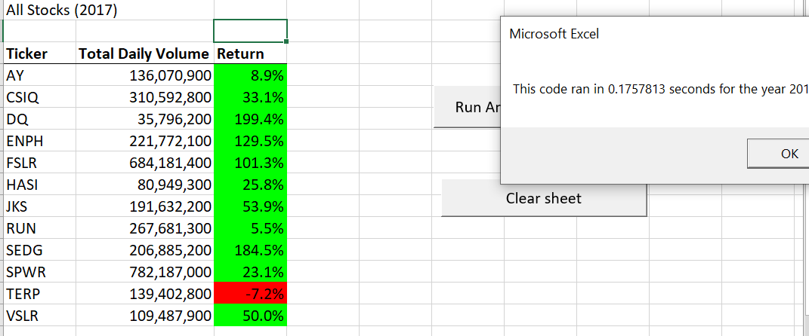
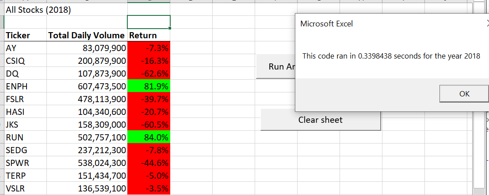

# Stock Analysis with VBA

## 1. Overview of Project
Volume and returns of 12 green energy stocks in 2017 and 2018 were analyzed using VBA. This project is to refactor the written script to make it run faster. In the future, if there are more stocks to be analyze, they can be added to the data sheet and the refactor script still runs smoothly.
 
## 2. Result

### 2.1 Return in 2017

- Looking at 2017 analysis result, we can say that 2017 is a good year for green energy stocks. **11 out of 12** tickers have **positive return**. Ticker **TERP** was the only ticker had negative return *(-7.2%)*
- There are **6 of 11** tickers (55%) have **return equal or greater than 50%**.

### 2.2 Return in 2018

- 2018 is not a good year for green energy stocks. Only 2 of 11 tickers have **positive return**: **ENPH** and **RUN**.
- However, only  **2** tickers had **negative return greater than 50%** (DQ and JKS).

### 2.3 Return Comparison
- Although returns went down in 2018, the decreased percentage was lower than the increased percentage in 2017. In order words, if one hold one of these tickers since 2017, he or she still gains.
- The only exception is ticker **TERP** which had negative return in both years. 

### 2.4 Original vs. Refactor Script
- With the original code, the computer took 0.84 second to run analysis for 2017 and 0.82 second to run analysis for 2018. 
- With the refactor code, the computer took only 0.18 second to run analysis for 2017 and 0.34 second to run analysis for 2018.
- In the refactor code, the analyst added one more variable tickerIndex to make the looping steps faster. Instead of having 2 for loop functions of 2 variable i and j, the refactor code only loops for i through the rows and columns.

## 3. Summary

### 3.1 Advantage of refactoring code

- The code is shorter and easy to understand.
- By reviewing an existing code to refactor, the analysts can find the drawbacks of their code and find ways to make their codes run more efficiently.

### 3.2 Disadvantage of refactoring code
- The analysts have to spend time working on an written code. 
- Refactoring may result to messing up an existing code when the script is long and complex. 
